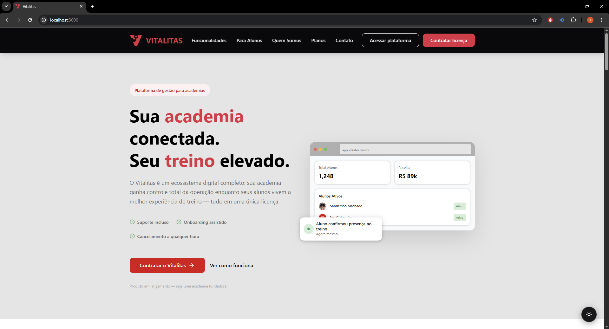

# Vitalitas — Frontend

> **Interface moderna para gestão integrada de academias — Web e Mobile.**



<p align="center">
  
  
  
  
  
  
</p>

---

> ℹ️ **Visão Geral:** Para entender o contexto acadêmico, a proposta de valor e o escopo do produto (MVP), acesse o **[README da Organização Vitalitas](https://dev.azure.com/VitalitasDevOps/Vitalitas/)**.

> 🎨 **[Link do Protótipo Figma — Clique aqui!](https://www.figma.com/proto/0NrgmDD9v0esjj0oIQD4KC/Website---Vitalitas?node-id=1796-118&t=BS6Y6p6UtcrFUDcx-1&scaling=min-zoom&content-scaling=fixed&page-id=939%3A3&starting-point-node-id=1796%3A118&show-proto-sidebar=1)**

---

## 📁 Estrutura do Repositório

Este repositório é um **monorepo** que contém os dois frontends do sistema:

### 🌐 Web

* **React + TypeScript + Tailwind**: base tecnológica para o desenvolvimento frontend.

### Tecnologias

* **React + TypeScript**: base para construção da interface
* **Tailwind CSS**: estilização utilitária e padronização visual
* **Vite**: build otimizado para desenvolvimento
* **Axios**: comunicação com o backend via HTTP
* **React Router DOM**: gerenciamento de rotas e navegação
* **JWT Decode**: decodificação de tokens para autenticação

### Arquitetura

A pasta `apps/web/src` possui a seguinte estrutura:

```text
apps/web/src/
├── assets/          → imagens e logos
├── components/      → componentes reutilizáveis e formulários
├── contexts/        → gerenciamento de sessão e permissões
├── hooks/           → reutilização de contexts e lógica compartilhada
├── pages/           → páginas principais do sistema
├── services/        → comunicação com o backend
└── utils/           → funções auxiliares
```

### Instalação e execução

```bash
# Na raiz do repositório, instale as dependências do monorepo
npm install

# Rode o projeto web
cd apps/web
npm run dev -- --port 3000
```

> ⚠️ O projeto deve ser executado na **porta 3000** devido à configuração do CORS.

---

# 📱 Mobile

O app mobile foi desenvolvido para o perfil **Aluno**, oferecendo uma experiência prática para acompanhar treinos, evolução e comunicados diretamente pelo celular — sem precisar acessar o navegador.

## Tecnologias

* **React Native + Expo**: desenvolvimento mobile multiplataforma
* **Expo Router**: navegação baseada em arquivos (similar ao Next.js)
* **AsyncStorage**: persistência de dados no dispositivo
* **Axios**: comunicação com a mesma API do web

## Arquitetura

O app segue uma separação clara de responsabilidades, mantendo a pasta `app/` exclusivamente para roteamento (Expo Router) e concentrando toda a lógica em `src/`:

```text
apps/mobile/
├── app/                         ← Roteamento (Expo Router — não alterar)
│   ├── _layout.tsx              ← Layout raiz e provider de autenticação
│   ├── index.tsx                ← Re-export da feature Auth
│   ├── aluno.tsx                ← Re-export da feature Aluno
│   └── resetpassword.tsx        ← Re-export da feature ResetPassword
├── assets/                      ← Recursos de imagem usados pelo Expo
└── src/
    ├── features/                ← Telas completas, isoladas por funcionalidade
    │   ├── aluno/
    │   │   └── pages/
    │   │       └── index.tsx
    │   ├── auth/
    │   └── resetpassword/
    ├── services/                ← Comunicação com a API
    │   ├── api.ts               ← Instância e config do Axios
    │   └── authService.ts       ← Funções de autenticação
    ├── shared/                  ← Recursos reutilizados entre múltiplas features
    │   └── components/          ← Componentes base
    │       ├── Button/
    │       └── Input/
    └── store/                   ← Estado global e hooks
        ├── AuthContext.tsx      ← Context de autenticação
        └── useAuth.ts           ← Hook de acesso ao contexto
```

> **Obs.:** cada tela em `app/` é um re-export simples da sua respectiva feature em `src/features/`. Toda lógica, estilo e subcomponentes locais vivem dentro da própria pasta da feature. Componentes base usados por mais de uma feature ficam centralizados em `src/shared/components/`, evitando duplicação de código.

> A arquitetura do Mobile segue a mesma filosofia da aplicação Web. A única diferença é a existência da pasta `app/`, obrigatória para o funcionamento do Expo Router.

---

# ⚙️ Opção 1 — Android Studio e Configuração do Ambiente

A configuração do ambiente mobile envolve a instalação do Android Studio, criação do emulador e configuração das variáveis de ambiente `ANDROID_HOME` e `JAVA_HOME`.

👉 **[Acesse o Guia Completo de Setup Mobile pelo Android Studio](./docs/MOBILE_SETUP.md)**

## Instalação e execução

```bash
# Rode o projeto mobile
cd apps/mobile
npm install
npx expo start
```

> ⚠️ O emulador Android deve estar rodando antes de executar `npx expo start`. Acesse o **Device Manager** no Android Studio e inicie o AVD desejado.

---

# 📲 Opção 2 — Executando com Expo Go

Baixe o aplicativo Expo Go pela Play Store do seu celular.

Para rodar o app no seu celular físico via **Expo Go**, use no terminal de comando:

```bash
cd apps/mobile
npm install
npx expo start --clear --tunnel
```

## O que cada flag faz

* **`--clear`**: limpa o cache do Metro Bundler antes de iniciar. Evita problemas chatos de "não atualizou nada mesmo depois de eu mudar o código" causados por cache antigo. Use sempre que o app estiver se comportando de forma estranha ou desatualizada.

* **`--tunnel`**: cria um túnel público (via serviço da Expo) para que o celular consiga acessar o Metro Bundler mesmo que o computador e o celular **não estejam na mesma rede local**, ou quando a rede bloqueia conexão direta entre dispositivos (ex: rede da faculdade, Wi-Fi com AP Isolation).

> ⚠️ **Importante:** o `--tunnel` só cria acesso remoto para o **Metro Bundler** (o próprio app React Native). Ele **não** cria túnel para a API .NET. Ou seja, mesmo com o tunnel ativo, seu celular só vai conseguir "abrir o app" — a comunicação com o backend continua dependendo da rede local ou de configuração manual do IP.

## Configuração do `.env`

Como o `--tunnel` não resolve o acesso à API, você precisa apontar manualmente no `.env` o IP da sua máquina na rede local, seguido da porta da API:

```env
EXPO_PUBLIC_API_URL=http://SEU_IP_LOCAL:5156
```

Substitua `SEU_IP_LOCAL` pelo IP da sua máquina (ex: `192.168.0.15`).

Sem isso configurado corretamente, mesmo com o túnel funcionando para abrir o app, as chamadas à API vão falhar — porque o celular vai tentar acessar `localhost`, que aponta pra ele mesmo, não pro seu computador.

Para descobrir seu IP local:

```bash
ipconfig
```

> **Windows:** procure por **"Endereço IPv4"**.

---

## ⚠️ Observação — Backend

Para que o celular consiga acessar a API, o backend precisa estar escutando em todas as interfaces de rede, não só em `localhost`:

```bash
dotnet run --urls=http://0.0.0.0:5156
```

Sem isso, mesmo com o `.env` configurado certinho no mobile, a API não vai aceitar conexões vindas de fora da própria máquina — e as requisições do celular vão cair em erro de conexão recusada.

---

# 🌿 Fluxo de Branches

O repositório segue um fluxo simples e direto, com duas branches principais:

| Branch | Finalidade                                                             |
| :----: | ---------------------------------------------------------------------- |
|  `prd` | Ambiente de **produção** — código estável e validado                   |
|  `des` | Ambiente de **desenvolvimento/testes** — integração contínua da equipe |

## Como funciona

```text
feature/nome_da_feature
          │
          ▼
         des
          │
          ▼
    [QA / Testes]
          │
          ▼
         prd
```

### 1. Crie uma branch de feature a partir de `des`

```bash
git checkout des
git checkout -b feature/nome_da_feature
```

### 2. Desenvolva e faça commits

Desenvolva e faça commits na sua branch normalmente.

### 3. Abra um Pull Request para `des`

Ao finalizar a implementação, abra um Pull Request direcionado para `des`.

### 4. Validação

A equipe de **QA valida** o comportamento na branch `des`.

### 5. Publicação

Validou? Abra um PR para `prd` e a feature vai ao ar.

> ⚠️ **Nunca faça commits diretos em `prd` ou `des`.** Todo código entra via Pull Request.

## Nomenclatura de Branches

|   Prefixo  | Uso                                     |
| :--------: | --------------------------------------- |
| `feature/` | Nova funcionalidade                     |
|   `fix/`   | Correção de bug                         |
|  `hotfix/` | Correção urgente em produção            |
|  `chore/`  | Ajustes técnicos, configs, refatorações |

**Exemplos:**

```text
feature/tela_treinos
fix/corrige_login
hotfix/token_expirado
```

---

# 👥 Equipe de Desenvolvimento — Frontend

### Arthur Guarita Brasil

📧 [arthur.guarita@sempreceub.com](mailto:arthur.guarita@sempreceub.com)

[](https://www.linkedin.com/in/arthur-guarit%C3%A1-brasil-09384b379/)

[](https://github.com/arthurguaritabrasil)

### Iuri Guimarães Pinheiro

📧 [iuri.gp@sempreceub.com](mailto:iuri.gp@sempreceub.com)

[](https://www.linkedin.com/in/iuri-guimar%C3%A3es-pinheiro-97159b310/)

[](https://github.com/IuriGP)

---

# 🤖 Ferramentas de IA utilizadas no desenvolvimento

O desenvolvimento deste projeto contou com o apoio de ferramentas de inteligência artificial em diferentes etapas do processo criativo e técnico:

| Ferramenta             | Uso                                                                                           |
| ---------------------- | --------------------------------------------------------------------------------------------- |
| **IA do Figma**        | Geração de ideias e sugestões visuais durante a prototipação das telas                        |
| **Figma Dev Mode**     | Extração automática de código CSS e especificações de design para implementação               |
| **Claude (Anthropic)** | Auxílio na escrita, revisão e formatação de código React/TypeScript durante o desenvolvimento |

> O uso dessas ferramentas reduziu significativamente o tempo de desenvolvimento das telas — o que antes levava cerca de 3 dias passou a ser concluído em poucas horas — permitindo maior foco na qualidade da implementação, na integração com o backend e na organização da arquitetura do projeto.

---

# 📄 Licença

Este projeto está sendo desenvolvido exclusivamente para fins acadêmicos na disciplina de Projeto Integrador do Centro Universitário de Brasília (UniCEUB) e foi atualizado completamente no 7º semestre (09 de junho 2026).

**Copyright © 2026 Vitalitas. Todos os direitos reservados.**
